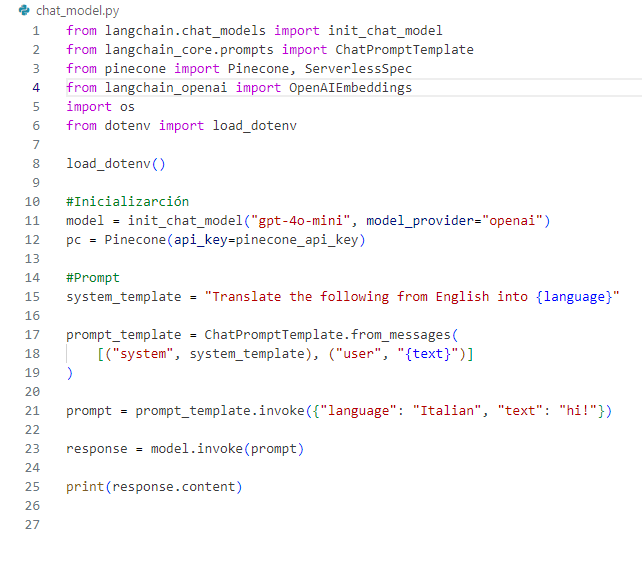
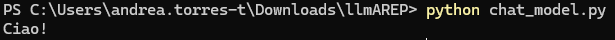
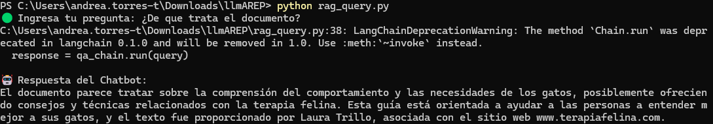

# Introduction to Creating RAGs (Retrieval-Augmented Generators) with OpenAI

Este laboratorio está diseñado para introducir a los estudiantes a los conceptos fundamentales y la implementación práctica de los Generadores de Recuperación Aumentada (RAG) utilizando las herramientas de OpenAI y el framework LangChain. Al finalizar el laboratorio, los estudiantes habrán adquirido experiencia práctica en la creación y comprensión de RAG.

## Getting Started
Estas instrucciones te permitirán obtener una copia del proyecto en funcionamiento en tu máquina local para propósitos de desarrollo y pruebas.

### Prerequisites
Para ejecutar este proyecto necesitas:

- python
- pinecone
- longchain
- PyMuPDFLoader

## Overview

Este proyecto implementa un sistema de Generación Aumentada de Recuperación (RAG) con LangChain, Pinecone y OpenAI. El sistema permite que un chatbot extraiga información relevante de documentos indexados y utilice un LLM (GPT-4) para generar respuestas informadas.

# Parte I

## LangChain LLM Chain & Pinecone Tutorial

## Overview

Este repositorio contiene dos tutoriales básicos:

1. **LangChain LLM Chain**: Implementación básica de una canalización de modelos de lenguaje.

2. **Base de datos vectorial Pinecone**: Almacenamiento y recuperación de incrustaciones para la búsqueda de similitud.

Estos tutoriales proporcionan las bases para construir un sistema avanzado de Recuperación-Generación Aumentada (RAG).

---

## **Part 1: LangChain**

### **1. Run the chat_model**



Ejecuta el script:

```bash
python chat_model.py
```

✅ Expected output:



---

## 🏗️ **Part 2: Pinecone Vector Database**

### **3️. run Pinecone**


Ejecuta el script:

```bash
python pinecone_setup.py
```

✅ Expected output:


### **5️. Query Embeddings**


Ejecuta el script:

```bash
python query_pinecone.py
```

✅ Expected output:


---

# Parte II
## Architecture

Este proyecto sigue un **enfoque de dos fases**:

1. **Fase de indexación** (rag_index.py)
- Carga documentos (PDF/TXT).
- Los divide en fragmentos más pequeños.
- Genera incrustaciones con OpenAI.
- Los almacena en **Pinecone** para una rápida recuperación.

2️. **Fase de recuperación y generación** (rag_query.py)
- Recibe una consulta del usuario.
- Busca fragmentos de documentos relevantes en Pinecone.
- Utiliza GPT-4 para generar una respuesta basada en los datos recuperados.

## Installation

### 1. Clonar el repositorio

```bash
git clone https://github.com/Andrea2511/llmAREP.git
cd your-repo
```

### 32. Install Dependencies

```bash
pip install -r requirements.txt
```

### 3. Set Up Environment Variables

Crear un `.env` archivo con las llaves de API:

```
OPENAI_API_KEY=your-openai-key
PINECONE_API_KEY=your-pinecone-key
PINECONE_ENVIRONMENT=your-pinecone-environment
```

## Running the Project

### **1️. Indexing Documents**
Coloca tus documentos en **PDFs and TXT files** dentro de la carpeta `data/` y ejecute el siguiente comando:

```bash
python rag_index.py
```

✔️ Expected output:

```
📂 Procesando archivo: document.pdf
✅ document.pdf cargado con 5 documentos.
📊 Se generaron 20 fragmentos para indexar.
✅ 20 fragmentos indexados en Pinecone.
```

### **2️. Querying the Chatbot**

```bash
python rag_query.py
```

✔️ Example Interaction:



## Author

Andrea Valentina Torres Tobar
---

